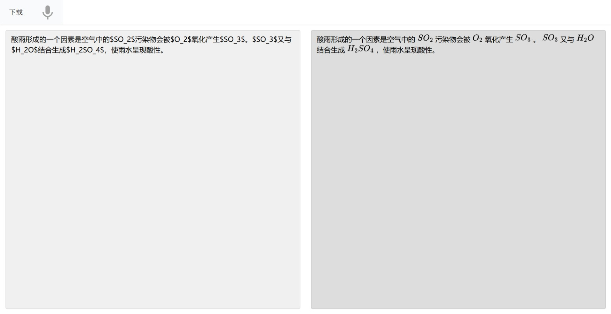

# 化学式语音输入网络服务
提供实时Chem Tex进行渲染的编辑器
使用腾讯云语音识别服务提供语音输入
使用LLM服务提供化学物质名词转Chem Tex

## 使用细节 - 对于使用者
- 确保有java21环境
- 下载预编译包并解压
- 运行bin/backend
- 首次运行会产生config.json
  - llm配置[deepseek API密钥](https://platform.deepseek.com/api_keys)
  - asr配置[腾讯云语音识别服务](https://cloud.tencent.com/act/pro/yuyin)
- 配置完成后运行即可
- 麦克风按钮点击一次开始录制，再次点击结束录制
- 点击下载可以下载左侧内容（markdown形式）
- 实时渲染功能不会花费DeepSeek Token和ASR额度

## 实现细节 - 对于开发者
- 项目采用Kotlin + Ktor作为后端，Vite + Vue + Typescript作为前端。
- 前端使用Vite Proxy对/api PATH做转发绕过CORS发送请求
- 后端采用RESTFul风格
  - 语音识别服务使用腾讯云一句话识别接口，首先使用[JavE](https://github.com/a-schild/jave2)对前端传入的webm数据包重编码到mp3，随后编码到base64。将识别结果返回给前端
  - 名词识别-替换服务使用DeepSeek-chat完成

